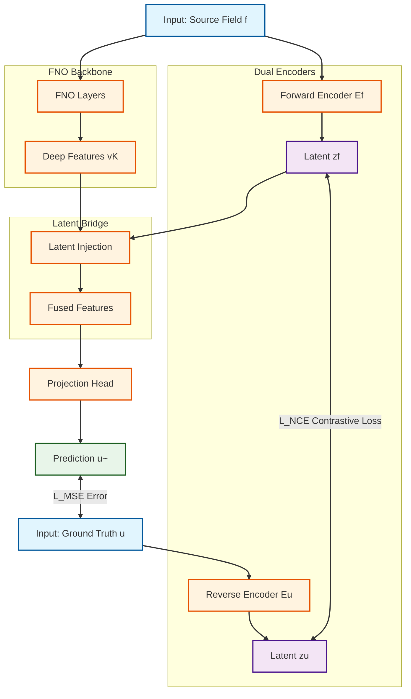

# Latent Reciprocity Network (LRN) Model Walkthrough

This document provides a technical walkthrough of the **Latent Reciprocity Network (LRN)** implemented in this repository. LRN constitutes a framework for augmenting neural operators (specifically FNO in this instance) with a bidirectional latent alignment mechanism to improve stability, generalization, and physical consistency.

## 1. High-Level Concept

Classical operators learn a unidirectional mapping $f \to u$. LRN introduces a "reciprocal" constraint by learning a shared latent manifold where the input $f$ and solution $u$ must align.

**Key Idea**: The operator should not just map pixels to pixels; it should condition its generation on a compact latent variable $z$ that consistently represents both the physical setup (input) and the physical result (solution).

## 2. Architecture Overview


The LRN-FNO model (`src/models/lrn_fno.py`) consists of four main distinct components:

### A. Dual Encoders (`src/models/encoders.py`)
Two parallel encoders map high-dimensional fields to a shared low-dimensional latent space $\mathbb{R}^{d_z}$.

1.  **Forward Encoder ($E_f$)**:
    *   **Input**: Source field $f$ (e.g., initial condition, forcing term).
    *   **Output**: Latent prior $z_f$.
    *   **Architecture**: CNN Backbone $\to$ Global Average Pooling $\to$ MLP Projection.
    *   **Role**: Always active. Provides the "context" for the operator during inference.

2.  **Reverse Encoder ($E_u$)**:
    *   **Input**: Solution field $u$ (ground truth).
    *   **Output**: Latent posterior $z_u$.
    *   **Architecture**: Symmetric to $E_f$.
    *   **Role**: **Training Only**. It acts as a "teacher" or constraint target for $z_f$.

### B. The Backbone ($G_\theta$) (`src/models/fno.py`)
The repository uses a Fourier Neural Operator (FNO) as the transformation backbone.
*   **1D/2D FNO**: Lifts input $f$ to a high-dimensional feature space, applies Fourier layers (convolution in spectral domain), and produces deep features $v_K$.

### C. The Latent Bridge (`src/models/latent_bridge.py`)
This is the integration point where the "Reciprocity" meets the "Operator".
*   **Input**: Backbone features $v_K$ and Forward Latent $z_f$ (vector).
*   **Mechanism**:
    1.  **Project**: $z_f$ is projected to a compatible channel dimension.
    2.  **Broadcast**: The vector is repeated spatially to match the resolution of $v_K$.
    3.  **Fuse**: A point-wise MLP (or Gated mechanism) combines the spatial features with the global latent context.
    *   *Equation*: $v_{latent} = \sigma(\text{MLP}(v_K \oplus \text{Proj}(z_f)))$

## 3. The Forward Pass (Step-by-Step)

When you run `model(f, u)`:

1.  **Impose Context**:
    *   $f$ is passed through $E_f$ to get **$z_f$**.
    *   (Training Only) $u$ is passed through $E_u$ to get **$z_u$**.

2.  **Backbone Processing**:
    *   $f$ flows through the standard FNO layers to yield feature map **$v_K$**.

3.  **Latent Injection**:
    *   The **Latent Bridge** takes $v_K$ and $z_f$.
    *   It injects the global context $z_f$ into every spatial point of $v_K$, producing **$v_{latent}$**.

4.  **Projection**:
    *   $v_{latent}$ is projected back to the solution domain size to generate **$\tilde{u}_{pred}$**.

## 4. Training Protocol

The power of LRN lies in its training phases:

*   **Objective**: Minimize Prediction Error ($\mathcal{L}_{MSE}$) AND Contrastive Error ($\mathcal{L}_{NCE}$).
*   **$\mathcal{L}_{NCE}$**: Forces $z_f$ (from input) and $z_u$ (from ground truth) to be similar (high cosine similarity) for the same sample, and dissimilar for mismatched samples.

## 5. Code Map

| Component | File | Class |
| :--- | :--- | :--- |
| **Orchestrator** | `src/models/lrn_fno.py` | `LRNFNO1d`, `LRNFNO2d` |
| **Encoders** | `src/models/encoders.py` | `ForwardEncoder`, `ReverseEncoder` |
| **Bridge** | `src/models/latent_bridge.py` | `LatentBridge`, `GatedLatentBridge` |
| **Backbone** | `src/models/fno.py` | `FNO1d`, `FNO2d` |

## 6. How to Use

To initialize a 2D LRN-FNO model (e.g., for Navier-Stokes):

```python
from src.models.lrn_fno import create_lrn_fno

model = create_lrn_fno(
    spatial_dim=2,
    in_channels=1,     # Source channels
    out_channels=1,    # Solution channels
    modes1=12,         # FNO modes X
    modes2=12,         # FNO modes Y
    width=32,          # Backbone width
    latent_dim=64,     # Size of reciprocal manifold
    use_gated_bridge=True # Advanced gating mechanism
)
```
